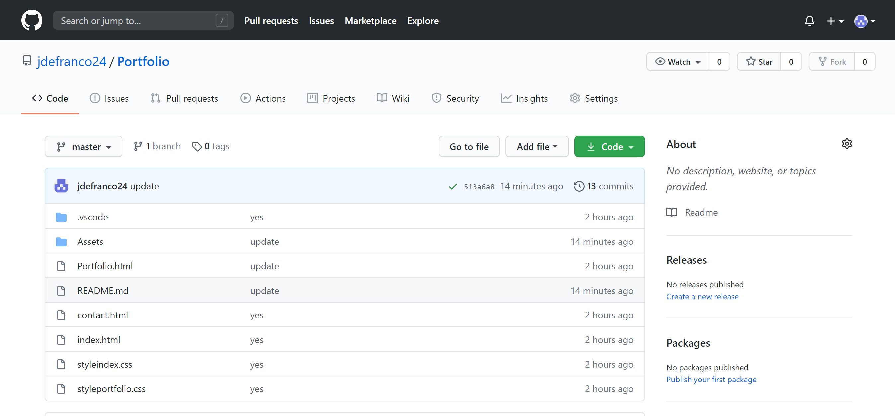
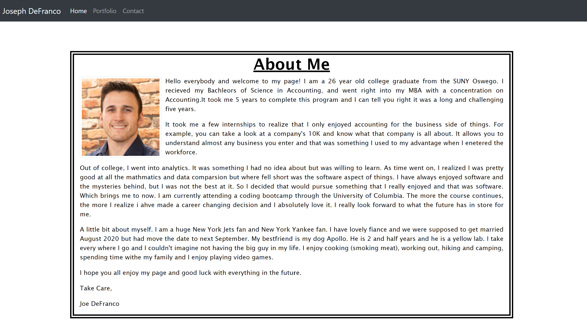
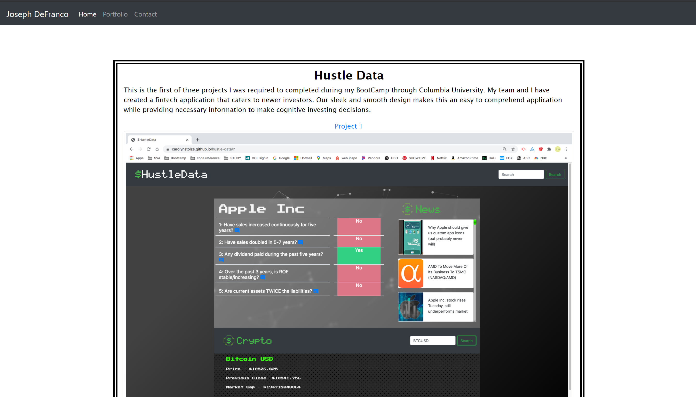
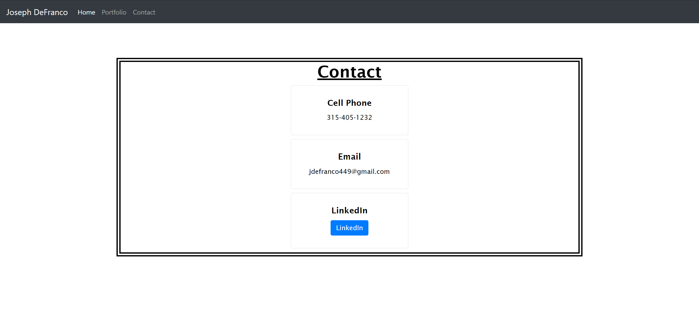

In this repo, we have my portfolio for the work I have accomplished so far throughout my very short developing career. 

The first tab (home), provides a quick about me and details of myself. Details that pertain to everyday life and interests. 

Second tab (portfolio), provides some of my course work throughout my bootcamp. This has one project and two homework assignments.

Third tab (contact), provides all information needed to contact me. Also, provides the link to my Linkedin profile, simply select the linkedin button to jump to my page.

